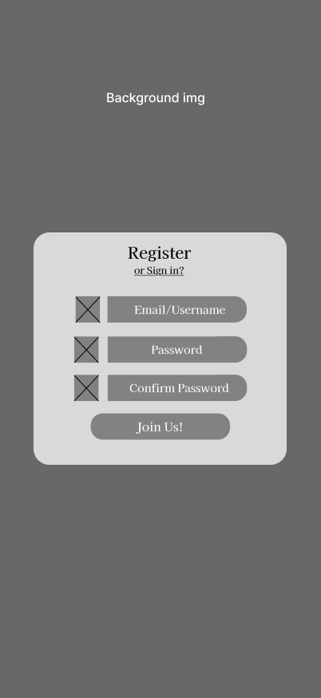
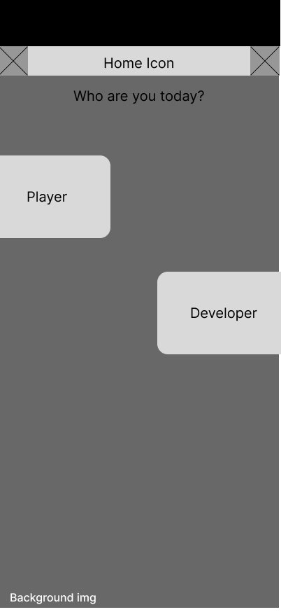
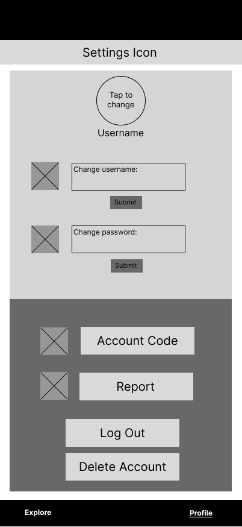

# User Experience Design

## Prototype

A clickable prototype of the app can be viewed here:
[FeedbackLoop Figma Prototype](https://www.figma.com/design/dA7fTFIXt8wbmF4XlFaZjh/Feedback-Loop?node-id=3-139&m=dev&t=wcBq4D0tlgEKJ2Mz-1)

---

## App Map

The app map below illustrates the overall hierarchy and navigation structure of FeedbackLoop. Users begin at the Login or Register screen, then proceed to the Home screen where they select their role either Player or Developer. Each role leads to a distinct dashboard with its own set of features. Both roles share access to a Profile/Settings screen and Notification Center.

---

## Wireframes

### Welcome

This is the initial landing screen users see when they first open the app. It displays the app branding before directing them to sign in or register.

### Sign In

The sign-in screen allows returning users to log in using their email or username along with their password. A link to the Register screen is provided for new users who do not yet have an account.

### Register

New users can create an account by entering their email or username, a password, and confirming that password. A link back to the Sign In screen is provided for users who already have an account.

### Home — Role Selection

After signing in, users are prompted to choose their role for the current session: Player or Developer. This determines which dashboard and set of features they see. The Home Icon at the top allows navigation back to this screen at any time.

---

## Player Screens

### Player Explore

The Player Explore screen is the main discovery hub for players. It displays a grid of available game projects, each showing a preview image, the project name, and buttons to join the playtest or follow the project. Tabs at the top allow toggling between the Explore and My Playtests views.

### Player Follow

This screen shows all projects the player is currently following. It allows players to keep track of games they are interested in and receive updates when developers post new content or open new playtests.

### Player Game Detail

When a player taps on a specific project, they see the game detail screen with information about the game, its current version, a link to download or access the playtest, and the developer's patch notes.

### Player Test

This screen shows the playtests the player has signed up for. From here, players can access the game and submit feedback once they have completed a playtest session.

### Player Discussion

The discussion screen allows players to engage in conversations about a game. Players can view discussion threads, read messages from other players and the developer, and participate in the conversation.

---

## Developer Screens

### Developer Dashboard

The Developer Dashboard is the main hub for developers. It lists all of their projects with status indicators (Published or Draft) and quick access links to Edit, view Feedback, and manage DevLogs for each project. A "Create New Project" button is prominently displayed at the top.

### Developer Log

The DevLog screen allows developers to post development updates and patch notes for their project. Players who follow the project will see these updates in their feed.

### Create a New Project

This screen walks the developer through creating a new project listing. They can enter project details such as the game's name, description, and other relevant information.

### Create a New Project — Continued

The second part of the project creation flow, where developers can upload files, add playtest links, and finalize the project listing before making it available to players.

### Project Management — Modify

This screen gives developers an overview of their project with options to modify its details, manage files, update the playtest link, and adjust project settings.

### Edit Project Info

Developers can update their project's title, description, images, and other metadata from this screen. Changes are saved and reflected on the public project page seen by players.

### Edit Project Info — Continued

Additional editing fields for the project, allowing developers to update more detailed information about their game.

### Account Code

This screen displays the developer's unique account code.

---

## Feedback Screens

### Feedback Form

The feedback form is what players fill out after completing a playtest. It supports multiple question types including multiple choice, slider ratings, and free text responses. Players can submit their feedback or discard it.

### Feedback Log

The feedback log gives developers a view of all feedback received for a project.

### Feedback Reply

This is a quick popup screen that allows devs to respond to feedback from their notification cener.

### Feedback Viewer

A detailed view of a single feedback submission, showing the player's responses to each question in the feedback form. Developers can review the full set of answers in one place.

### Questionnaire Builder

Developers can create custom feedback forms for their playtests. This screen allows them to set a title and add new questions to the form before saving and publishing it.

### Questionnaire Builder — Adding Questions

These screens show the step by step flow of adding different question types like multiple choice, slider or free text to a feedback form using the questionnaire builder.

---

## Settings & Account Screens

### Settings

The Settings screen serves as the user's profile management hub. Users can change their profile picture, update their username or password, view their account code, file a report, log out, or delete their account.

### Profile Picture Change

This screen allows users to upload or change their profile picture.

### Notification Center

The Notification Center displays all recent notifications for the user, including updates from followed projects, feedback responses, and other activity.

### Info Change Confirmation

A confirmation dialog that appears when a user successfully updates their account information.

### Confirm Account Deletion

A confirmation dialog that asks the user to verify they want to permanently delete their account.

### Report Form

Users can submit a report if they encounter inappropriate content or behavior. The form collects details about the issue for review by the platform administrators.

### Report Confirmation

A confirmation screen shown after a report has been successfully submitted.

